<!-- _class: lead -->
<!-- _paginate: false -->
# Smartphone Addiction Classification  
# and Screen Time Prediction

Machine Learning Assignment Presentation

<b>Student:</b> Etsubdink Zebre 
<b>ID:</b> GSE/0523/18 
<b>Date:</b> 23/3/2026

---

## Problem Statement
- This project solves two supervised machine learning problems from smartphone usage data:
  - **Task 1 (Classification):** Predict smartphone addiction level (`addiction_level`)
  - **Task 2 (Regression):** Predict daily screen time in hours (`daily_screen_time_hours`)
- Why this matters:
  - Helps identify high-risk phone usage patterns
  - Supports digital wellbeing planning for students/users
  - Demonstrates real-world use of ML in behavior analytics

---

## Dataset Overview
- Dataset source: Public smartphone usage dataset (CSV)
- File used: `Smartphone_Usage_And_Addiction_Analysis_7500_Rows.csv`
- Total records: **7,500**
- Data type: tabular, mixed numerical + categorical
- Example input features:
  - age, gender, social_media_hours, gaming_hours
  - notifications_per_day, app_opens_per_day
  - work_study_hours, sleep_hours, weekend_screen_time, stress_level
- Target variables:
  - Classification target: `addiction_level`
  - Regression target: `daily_screen_time_hours`

---

## ML Process Workflow
1. Problem Definition
2. Data Collection
3. EDA and Data Preparation
4. Algorithm Selection
5. Model Development and Training
6. Evaluation and Hyperparameter Tuning
7. Final Testing
8. Deployment Demo
9. Monitoring Plan and Documentation

**Approach:** baseline models first, then tuning the best model.

---

## EDA: Class and Target Distribution
- Key insights:
  - Addiction classes are not perfectly separated, so classification is harder
  - Daily screen time shows a stable pattern suitable for regression
  - Dataset size is enough for model comparison and tuning

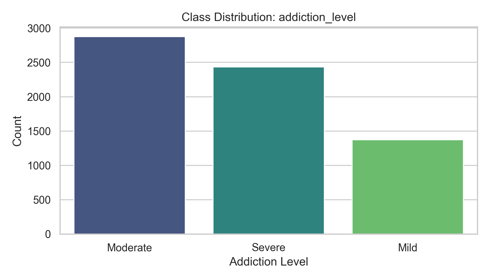

---

## EDA: Target Distribution (Screen Time)
- The target for regression is continuous and suitable for regression modeling
- The distribution supports learning stable patterns for prediction

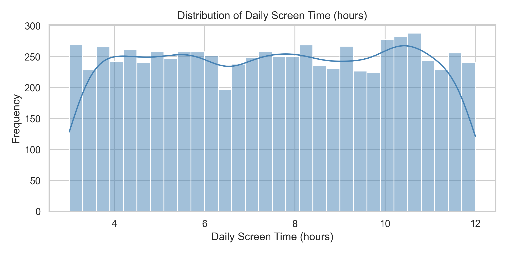

---

## EDA: Correlation and Feature Behavior
- Key interpretation:
  - Usage-related features show relationship with both targets
  - Higher social/gaming activity is generally linked with higher usage outcomes
  - EDA insights guided feature engineering and model selection
  - Correlation is useful, but not equal to causation

  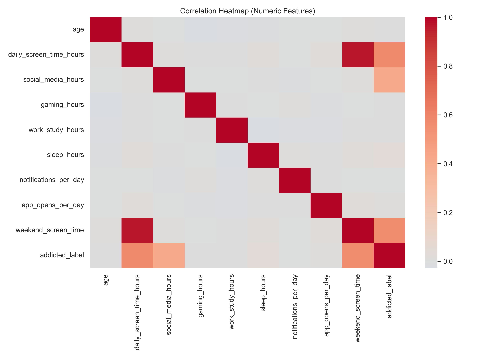
  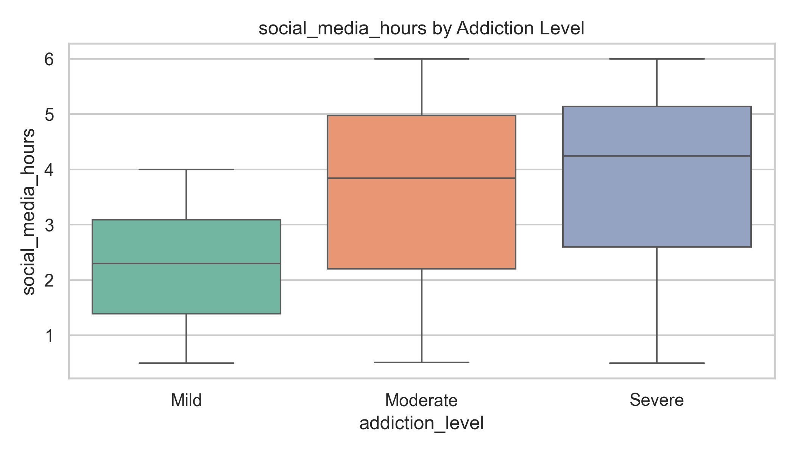

---

## Classification Modeling
- Objective: Predict `addiction_level`
- Models tested:
  - Logistic Regression
  - Random Forest Classifier
  - SVM (RBF)
- Metrics used: Accuracy and Weighted F1 (main metric)
- Weighted F1 chosen because it balances precision and recall across classes

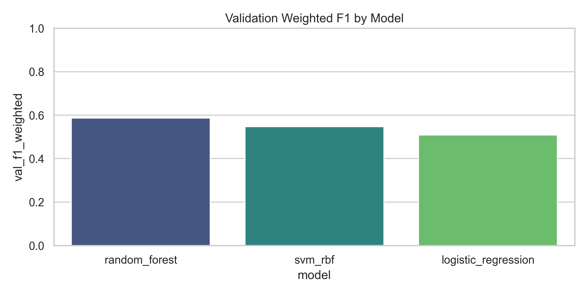

---

## Classification Final Result
- Best model (after tuning): **Random Forest Classifier**
- Final classification performance:
  - Test Accuracy: **0.5617**
  - Test Weighted F1: **0.5583**
  - Best CV Weighted F1: **0.5730**
- Interpretation:
  - Performance is moderate; class behavior overlap reduces separability
  - Useful as a baseline, can improve with richer features and class balancing

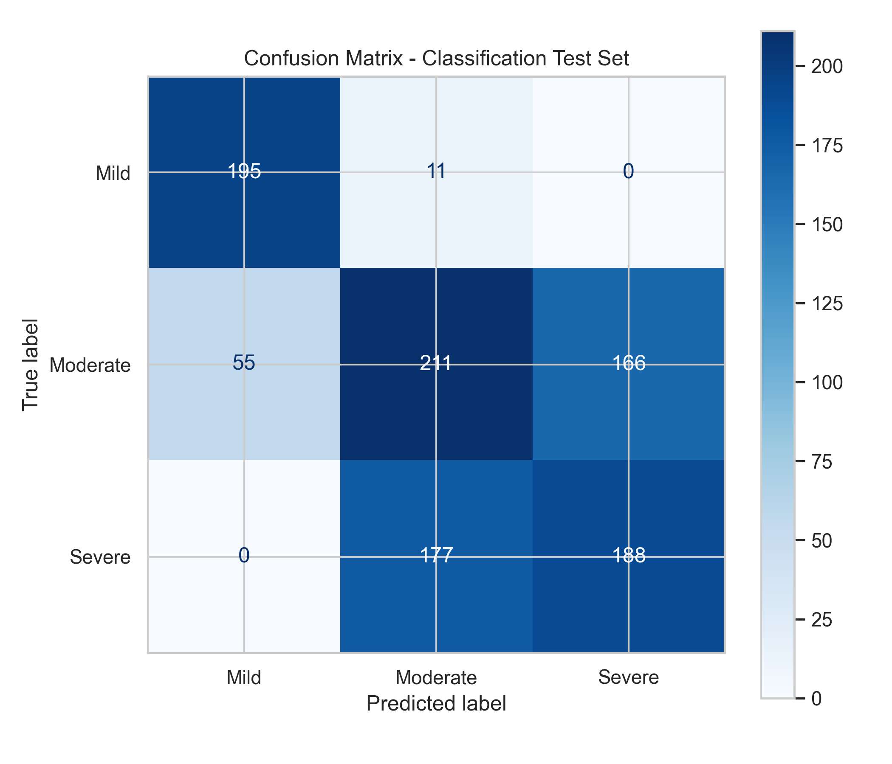

---

## Regression Modeling
- Objective: Predict `daily_screen_time_hours`
- Models tested:
  - Linear Regression
  - Random Forest Regressor
  - Gradient Boosting Regressor
- Main metrics: RMSE (main), MAE, R2
- Tuning method: GridSearchCV
- RMSE chosen because it penalizes larger errors more strongly

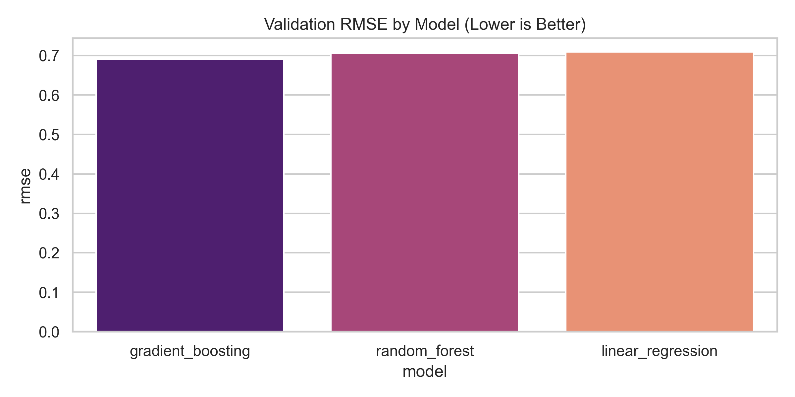

---

## Regression Final Result
- Best model (after tuning): **Random Forest Regressor**
- Final regression performance:
  - MAE: **0.5937**
  - RMSE: **0.7008**
  - R2: **0.9300**
  - Best CV RMSE: **0.6793**
- Interpretation:
  - Regression model performs strongly and predicts screen time well
  - High R2 means the model explains most variance in the target

  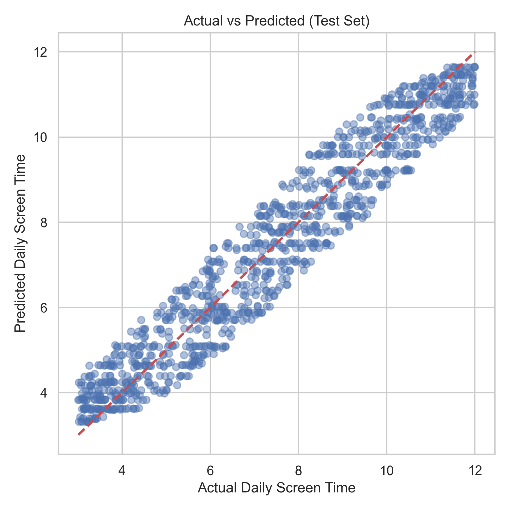
  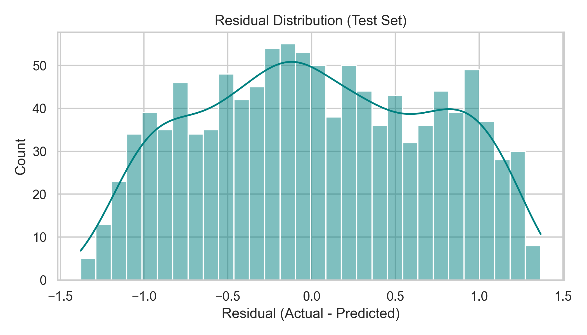

---

## Deployment Demo
- Local deployment completed using Streamlit
- App file: `app/streamlit_app.py`
- App flow: user enters behavior values, then gets addiction + screen-time predictions
- Built-in recommendation layer:
  - Lower-risk: maintain healthy habits
  - Moderate risk: reduce notifications and set app limits
  - High-risk (including Severe): use focus/bedtime mode and phone-free blocks
- Run command: `streamlit run app/streamlit_app.py`
- Live app URL: [https://smartphoneml.streamlit.app/](https://smartphoneml.streamlit.app/)

  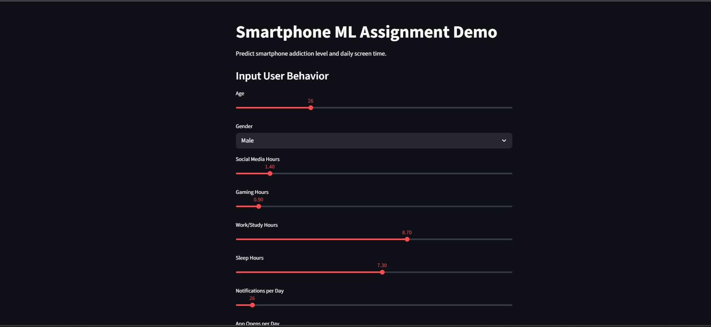
  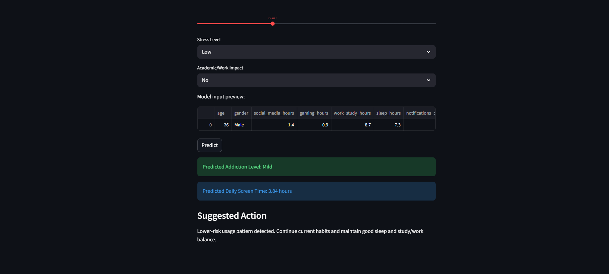

---

## Conclusion and Future Work
- Completed a full ML workflow for classification and regression tasks
- Final results:
  - Classification: Accuracy **0.5617**, Weighted F1 **0.5583** (moderate)
  - Regression: RMSE **0.7008**, R2 **0.9300** (strong)
- Main limitation: behavior overlap makes class separation difficult
- Future work: richer features, class balancing, explainability, and periodic retraining

---

<!-- _class: end -->
## Thank You  

